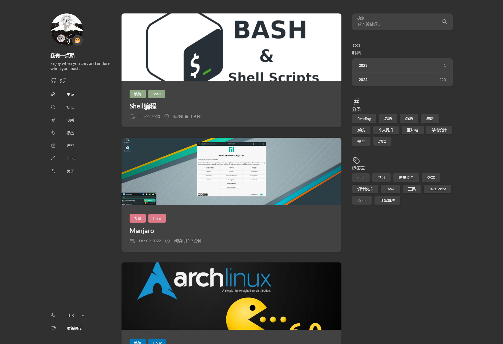
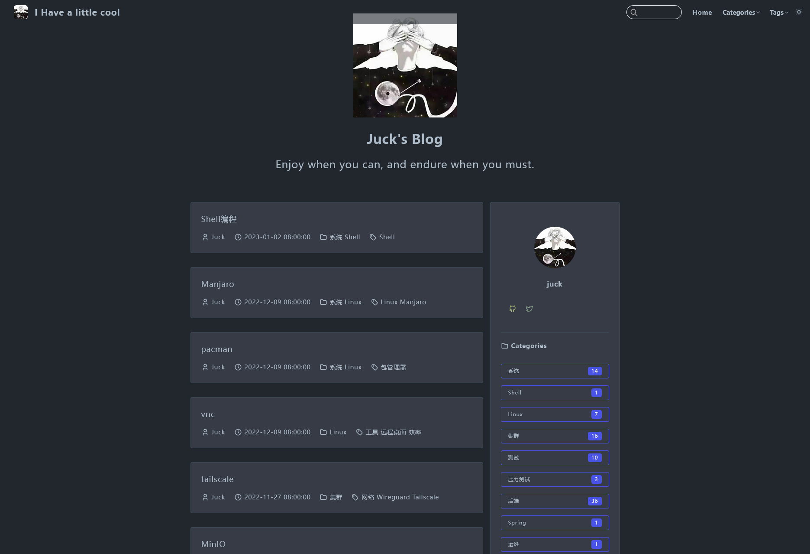

<h1 align="center">
  
</h1>

[English Doc](./README_en.md)
[中文文档](#)

  
<h2>🌱 个人博客</h2>

  <table><tr><td valign="top">
    <h3>Hugo版（主）</h3>
    
     
    
  </td><td valign="top">
    <h3>Vuepress版（备）</h3>
    
     
    
  </td></tr></table>

  <h3>⏳ 站点测速</h3>

  

    
  

  
<h2>🔭 我正在做</h2>

  

    
  

  

    
  

<!-- 

  
<h2>🌱 我正在学</h2>

 -->

  
<h2>🛠️ 常用工具集</h2>

  <!-- Some badges are from https://github.com/Ileriayo/markdown-badges -->

  <h3>👨‍💻 编程和标记语言</h3>

  <!--  -->

  

      
      
      
      
      
      
      
      
      
      
      
      
      
      
      
  

  <h3>🧰 框架和库</h3>

  

      
      
      
      
      
      
      
      
      
      
      
      
      
      
      
      
      
      
      
      
      
  

  <h3>🗄️ 数据库和云托管</h3>

  

      
      
      
      
      
      
      
      
      
  

  <h3>💻 平台、软件和工具</h3>

  <!-- TODO Rook -->
  

    
    
    
    
    
  

  

    
    
    
    
    
    
    
    
    
    
  

  

      
      
      
      
      
      
      
      
      
      
      
      
      
      
      
      
      
      
  

  
<h2>📊 GitHub 统计数据和活动</h2>

  <h3>🔥 连续数据</h3>

  

    
  

  <!-- 

    
  
 -->

  <h3>💻 GitHub 简介数据</h3>

  <!-- 
  
 -->

  <!-- https://github.com/anuraghazra/github-readme-stats -->

 

  <!-- https://github.com/ashutosh00710/github-readme-activity-graph -->

  <!-- <h3>⚡ Recent GitHub Activity</h3> -->

  <!-- https://github.com/jamesgeorge007/github-activity-readme -->
  <!--START_SECTION:activity-->

  <!-- 1. 🎉💪 Merged PR [#445](https://github.com/DenverCoder1/github-readme-streak-stats/pull/445) in [DenverCoder1/github-readme-streak-stats](https://github.com/DenverCoder1/github-readme-streak-stats) -->
<!--END_SECTION:activity-->

  
<h2>📫 如何联系我</h2>

  

<!--  -->

<!--  -->
